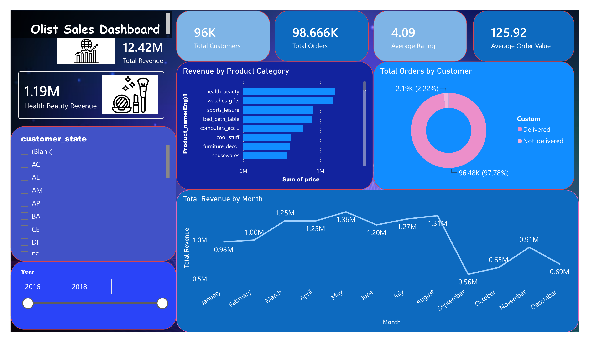
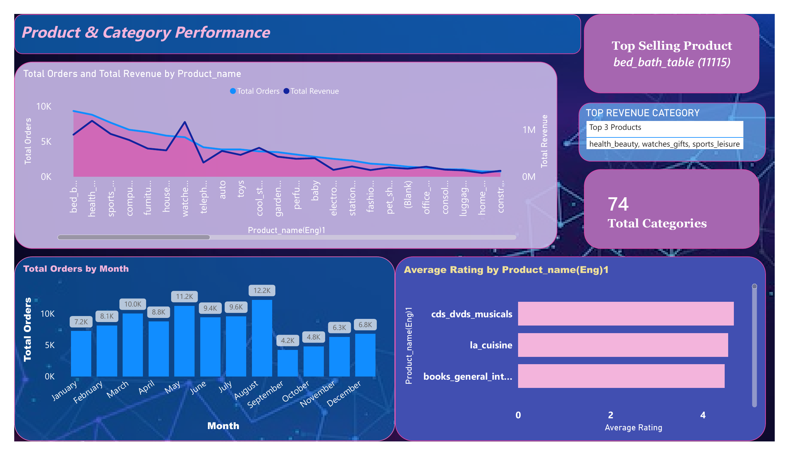
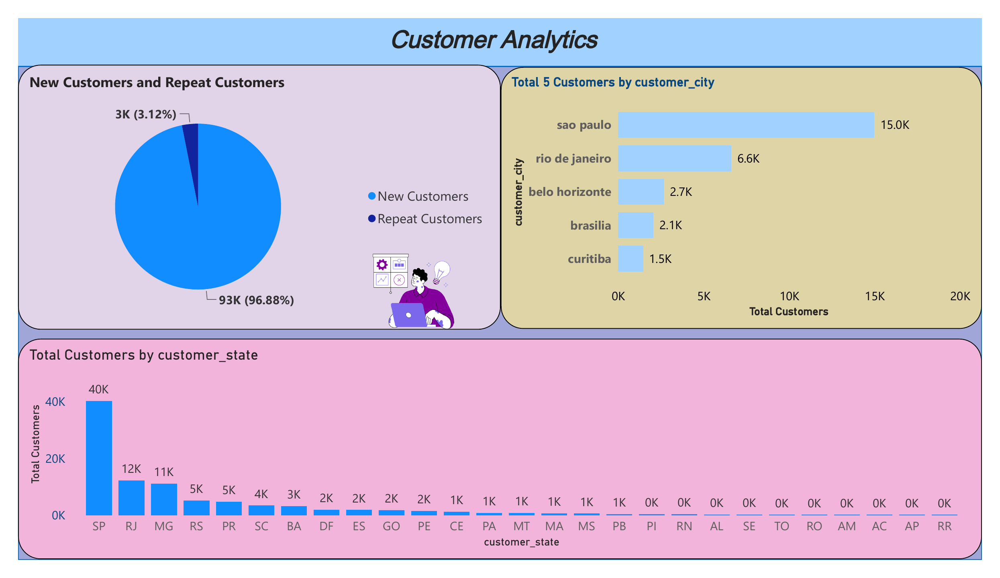
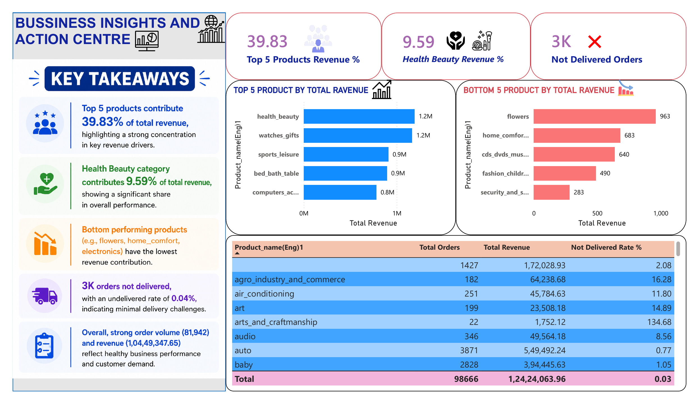
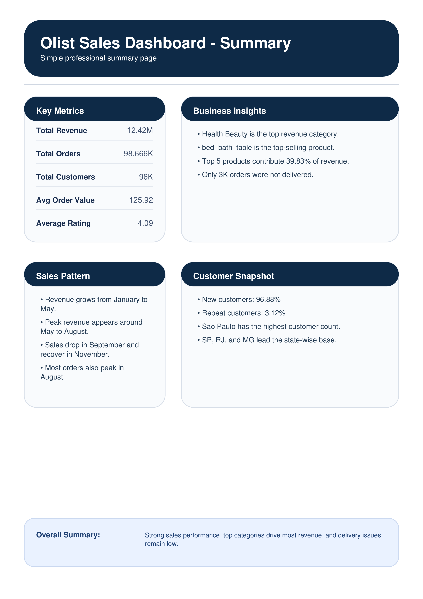
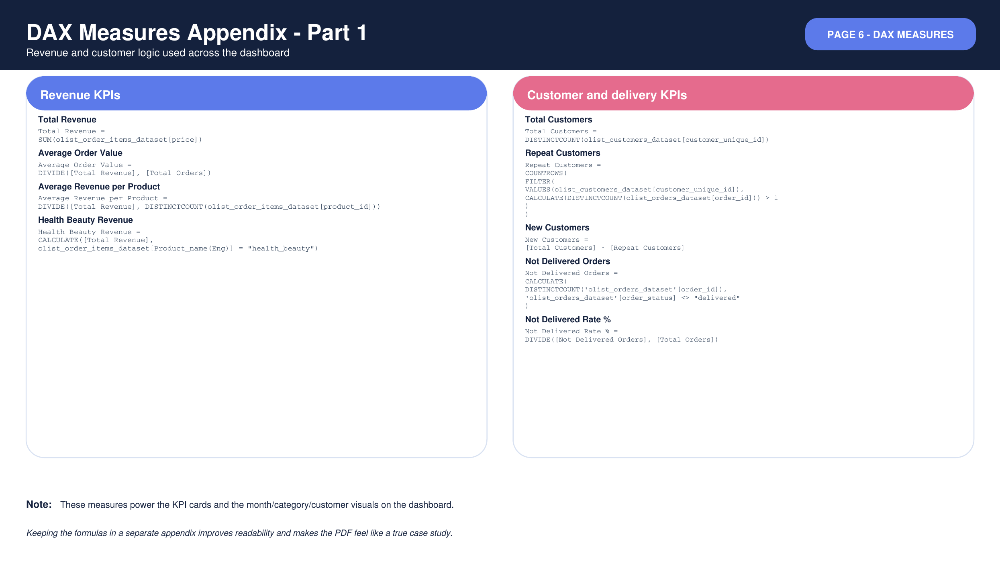
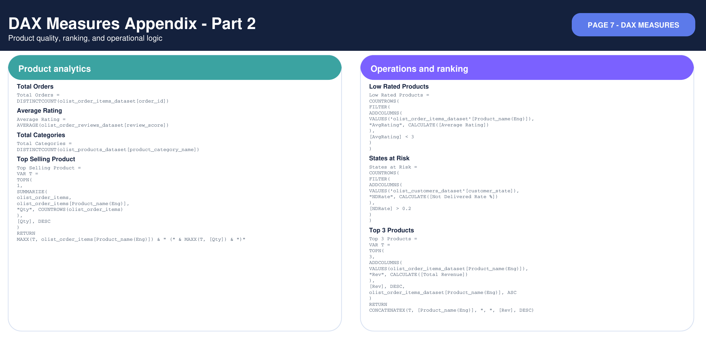

# Olist Sales Analysis Dashboard

A professional Power BI business intelligence project built on the Olist e-commerce dataset.  
This dashboard presents sales performance, product analysis, customer analytics, operational risk indicators, and DAX-based technical documentation in a case-study format.

---

## Project Summary

This project was built to analyze Olist's sales data through an interactive Power BI dashboard.  
The report combines business metrics, product performance, customer behavior, delivery issues, and DAX measures to create a complete analytics story.

---

## Tools Used

- Power BI Desktop
- DAX (Data Analysis Expressions)
- Power Query
- Data Modeling
- Data Visualization
- Business Intelligence

---

## Dashboard Highlights

- Total Revenue
- Total Orders
- Total Customers
- Average Order Value
- Average Rating
- Revenue by Month
- Revenue by Product Category
- Top Selling Product
- New vs Repeat Customers
- Not Delivered Orders
- States at Risk
- Business Insights and Action Center
- Executive Summary
- DAX Measures Appendix

---

## Key Business Insights

- Revenue is analyzed across months, categories, and product performance.
- Health & Beauty is one of the strongest revenue categories.
- Repeat customers are a small part of the customer base, showing retention opportunities.
- Delivery performance highlights operational bottlenecks.
- Top and bottom product analysis helps identify growth and risk areas.
- DAX measures are documented separately to show technical depth and clean modeling.

---

## DAX Measures Included

- Total Revenue
- Total Orders
- Total Customers
- Average Order Value
- Average Rating
- Average Revenue per Product
- Health Beauty Revenue
- Health Beauty Revenue %
- New Customers
- Repeat Customers
- Not Delivered Orders
- Not Delivered Rate %
- Top Selling Product
- Top 3 Products
- Top 5 Products Revenue %
- Low Rated Products
- States at Risk
- Total Categories

---

## Dashboard Pages

### Page 1: Sales Dashboard
Revenue KPIs, monthly trend, order status, category revenue, and state filters.

### Page 2: Product & Category Performance
Top-selling products, category analysis, rating analysis, and monthly order trends.

### Page 3: Customer Analytics
Customer distribution by state and city, plus new vs repeat customer analysis.

### Page 4: Business Insights & Action Center
Top and bottom revenue products, delivery risk, and actionable business insights.

### Page 5: Executive Summary
A case-study style summary explaining project value and key findings.

### Page 6: DAX Measures Appendix - Part 1
Revenue and customer measures used in the report.

### Page 7: DAX Measures Appendix - Part 2
Product, ranking, and operational measures used in the report.

---

## Dashboard Preview

### Page 1 - Sales Dashboard

### Page 2 - Product & Category Performance

### Page 3 - Customer Analytics

### Page 4 - Business Insights & Action Center

### Page 5 - Executive Summary

### Page 6 - DAX Measures Appendix Part 1

### Page 7 - DAX Measures Appendix Part 2

---

## Files in This Repository

- `PowerBI_project.pdf`
- `page-1.png`
- `page-2.png`
- `page-3.png`
- `page-4.png`
- `page-5.png`
- `page-6.png`
- `page-7.png`

---

## Author

**Shubham Kamal**  
B.Tech, Ceramic Engineering  
IIT (BHU) Varanasi
